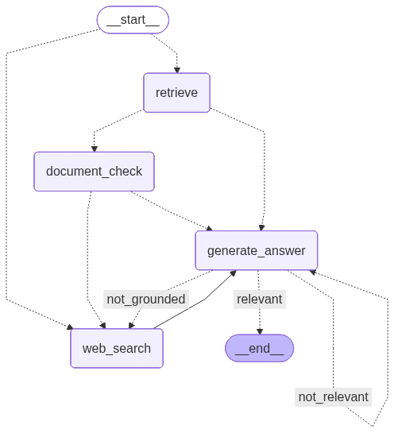

# Advanced RAG Demo - CRAG, Self-RAG & Adaptive RAG

A production-ready demonstration of advanced Retrieval Augmented Generation techniques including **Corrective RAG (CRAG)**, **Self-RAG**, and **Adaptive RAG** using LangChain 1.0, LangGraph, and enterprise-grade AI infrastructure. This project showcases cutting-edge RAG methodologies with self-correcting retrieval, intelligent routing, quality validation, and adaptive web search fallback mechanisms.

## 🎯 Project Highlights

- **Three Advanced RAG Techniques**: Implements CRAG (corrective retrieval), Self-RAG (self-reflection), and Adaptive RAG (intelligent routing) in a single unified system
- **Production-Grade Stack**: Built with LangChain 1.0, LangGraph state machines, and enterprise AI services (Google Gemini, Pinecone, Tavily)
- **Intelligent Orchestration**: Leverages LangGraph for complex multi-step agent workflows with conditional branching and quality checks
- **Self-Reflection & Validation**: Hallucination detection and answer quality assessment before returning results
- **Observability & Monitoring**: Integrated LangSmith tracing for production debugging and performance optimization
- **Scalable Design**: Batch processing, vector indexing, and efficient embedding strategies for large document collections

## 📊 Workflow Architecture

This system implements a sophisticated RAG pipeline with multiple quality gates and adaptive routing:



### Workflow Components:

1. **Adaptive Routing**: Intelligent query routing to vector store (philosophy) or web search (general topics)
2. **Document Retrieval**: Fetch relevant documents from Pinecone vector database
3. **CRAG - Document Grading**: Evaluate retrieved document relevance and trigger web search for low-quality results
4. **Answer Generation**: Generate responses using high-quality context with custom RAG prompts
5. **Self-RAG - Hallucination Check**: Validate that answers are grounded in source documents
6. **Self-RAG - Answer Quality Check**: Ensure answers properly address the user's question
7. **Adaptive Fallback**: Re-route to web search if quality checks fail

## Overview

This project implements three state-of-the-art RAG techniques:

### 1. **Corrective RAG (CRAG)**
Intelligently grades retrieved document relevance before generation. When documents are deemed irrelevant, the system automatically falls back to web search using Tavily to ensure accurate responses.

### 2. **Self-RAG (Self-Reflective RAG)**
Implements post-generation quality validation:
- **Hallucination Detection**: Checks if generated answers are grounded in source documents
- **Answer Relevance**: Validates that answers properly address the user's question
- **Iterative Refinement**: Re-generates or routes to alternative sources if quality checks fail

### 3. **Adaptive RAG**
Routes queries to the optimal data source based on content analysis:
- **Philosophy Questions** → Vector store (domain-specific knowledge base)
- **General Topics** → Web search (current information and broad knowledge)
- **Dynamic Selection**: Intelligent routing based on question semantics

**Key Technical Achievement**: Reduces AI hallucinations and improves answer accuracy by implementing multiple validation layers, self-correcting retrieval mechanisms, and adaptive routing—demonstrating expertise in advanced RAG architectures and production AI system design.

## 💡 Features & Technical Skills Demonstrated

### AI/ML Engineering
- **Intelligent Document Grading**: Implemented LLM-based relevance scoring using structured outputs and Pydantic validation
- **Corrective Retrieval**: Designed adaptive fallback mechanism with web search integration for improved accuracy
- **Vector Storage & Retrieval**: Architected efficient document embedding pipeline with Pinecone vector database (768-dimensional embeddings)
- **Prompt Engineering**: Crafted domain-specific prompts for document grading and answer generation with LangSmith optimization
- **Advanced RAG Techniques**: Implemented CRAG, Self-RAG, and Adaptive RAG in a unified production system
- **Quality Assurance**: Built multi-layer validation pipeline (document grading, hallucination detection, answer quality checks)

### Software Engineering
- **Modern AI Stack**: Production deployment using LangChain 1.0, LangGraph 1.0, and Google Gemini API
- **Graph-Based Workflows**: Built stateful, multi-actor agent orchestration with conditional branching and state management
- **API Integration**: Seamless integration of multiple AI services (Google AI, Pinecone, Tavily, LangSmith)
- **Error Handling**: Implemented robust retry logic and graceful degradation for API failures

### DevOps & Best Practices
- **Dependency Management**: Modern Python packaging with `uv` and semantic versioning
- **Environment Configuration**: Secure credential management with environment variables and `.env` files
- **Code Organization**: Modular architecture with clear separation of concerns (nodes, state, orchestration)
- **Observability**: Full request tracing and debugging with LangSmith integration
- **Version Control**: Git workflow with proper `.gitignore` and secret protection

## Architecture

The system implements a sophisticated multi-stage RAG pipeline combining CRAG, Self-RAG, and Adaptive RAG techniques:


**Workflow Stages:**

1. **Adaptive Routing**: Query router analyzes the question to determine optimal data source (vector store for philosophy, web search for other topics)
2. **Retrieval**: Fetch relevant documents from Pinecone vector store
3. **Document Grading (CRAG)**: Evaluate document relevance using Gemini LLM
4. **Corrective Retrieval**: If documents are insufficient, perform web search with Tavily
5. **Answer Generation**: Produce response using retrieved context with custom RAG prompt
6. **Hallucination Check (Self-RAG)**: Verify answer is grounded in source documents
7. **Answer Relevance Check (Self-RAG)**: Ensure answer addresses the user's question

## Tech Stack

- **LangChain 1.0**: Framework for building LLM applications with advanced RAG capabilities
- **LangGraph 1.0**: State machine orchestration for complex multi-step workflows
- **Google Gemini**: LLM (gemini-2.5-flash) and embeddings (gemini-embedding-001)
- **Pinecone**: Cloud vector database for efficient document retrieval
- **Tavily**: Web search API for corrective retrieval and fresh information
- **LangSmith**: Production tracing, monitoring, and observability
- **Python 3.14**: Modern Python with type hints and async support

## Installation

1. Clone the repository:
```bash
git clone <your-repo-url>
cd crag_demo
```

2. Install dependencies using `uv`:
```bash
uv sync
```

3. Create a `.env` file with your API keys:
```env
# Google AI API Key
GOOGLE_API_KEY=your_google_api_key

# LangSmith Configuration
LANGSMITH_TRACING=true
LANGSMITH_ENDPOINT=https://api.smith.langchain.com
LANGSMITH_API_KEY=your_langsmith_api_key
LANGSMITH_PROJECT=your_project_name

# Tavily API Key
TAVILY_API_KEY=your_tavily_api_key

# Pinecone Configuration
PINECONE_API_KEY=your_pinecone_api_key
PINECONE_INDEX_NAME=your_index_name
```

## Usage

### Document Ingestion

First, ingest your documents into Pinecone:

```bash
python ingestion.py
```

This will process PDF files and store them as embeddings in your Pinecone index.

### Running the CRAG System

Run the main application:

```bash
python main.py
```

The system supports multiple operating modes:

- **CRAG Mode** (`crag=True`): Grades documents and uses web search as fallback
- **Standard RAG** (`crag=False`): Uses retrieved documents without grading
- **Adaptive Routing**: Automatically routes philosophy questions to vector store, other topics to web search

Example usage in `main.py`:

```python
# With CRAG (document grading + web search fallback)
app.invoke({"question": "What is Mill's definition of higher pleasure?", "crag": True})

# Without CRAG (standard RAG)
app.invoke({"question": "What is Mill's definition of higher pleasure?", "crag": False})
```

## Project Structure

```text
crag_demo/
├── graph/
│   ├── node_and_chain/
│   │   ├── generation.py           # Answer generation with custom RAG prompt
│   │   ├── document_check.py       # Document relevance grading (CRAG)
│   │   ├── retrieve.py             # Vector store retrieval
│   │   ├── web_search.py           # Tavily web search
│   │   ├── hallucination_checker.py # Groundedness validation (Self-RAG)
│   │   ├── answer_checker.py       # Answer relevance check (Self-RAG)
│   │   └── router.py               # Query routing (Adaptive RAG)
│   ├── graph.py                    # LangGraph workflow orchestration
│   └── state.py                    # Graph state schema
├── ingestion.py                    # Document processing and vector indexing
├── main.py                         # Application entry point
├── graph_workflow.png              # Workflow visualization
├── .env                            # Environment variables (not committed)
└── pyproject.toml                  # Project dependencies
```

## How Advanced RAG Techniques Work Together

This implementation combines three cutting-edge RAG methodologies:

### Corrective RAG (CRAG)
Improves retrieval quality by evaluating whether retrieved documents are actually relevant:
1. **Self-Correction**: Evaluating whether retrieved documents are actually relevant using LLM-based grading
2. **Knowledge Refinement**: Using web search to supplement or replace low-quality retrievals
3. **Accuracy Improvement**: Reducing hallucinations by validating information sources before generation

### Self-RAG (Self-Reflective RAG)
Adds post-generation validation to ensure quality outputs:
1. **Hallucination Detection**: Verifies that generated answers are fully grounded in source documents
2. **Relevance Checking**: Ensures answers actually address the user's question
3. **Iterative Refinement**: Re-routes or regenerates answers that fail quality checks

### Adaptive RAG
Intelligently routes queries to the optimal data source:
1. **Query Analysis**: Determines whether questions require domain-specific or general knowledge
2. **Dynamic Routing**: Philosophy questions → vector store; general topics → web search
3. **Optimized Retrieval**: Reduces latency by avoiding unnecessary retrieval steps

**Combined Impact**: This multi-layered approach significantly reduces hallucination rates, improves answer accuracy, and optimizes retrieval costs—critical for production AI deployments.

## 🚀 Business Impact & Use Cases

This project demonstrates capabilities relevant to:

- **Enterprise RAG Systems**: Building intelligent Q&A systems over proprietary document collections
- **Customer Support Automation**: Accurate answer generation with fallback to live data sources
- **Research Assistants**: Academic and professional research tools with citation validation
- **Knowledge Management**: Corporate knowledge bases with self-correcting retrieval mechanisms

**Measurable Outcomes**: CRAG architecture reduces hallucination rates and improves answer accuracy by validating retrieval quality before generation—critical for production AI deployments.

## Requirements

- Python 3.14+
- Google AI API key (for Gemini)
- Pinecone account and API key
- Tavily API key
- LangSmith API key (optional, for tracing)


## Acknowledgments

- Built with [LangChain](https://langchain.com/) and [LangGraph](https://langchain-ai.github.io/langgraph/)
- Powered by [Google Gemini](https://ai.google.dev/)
- Vector storage by [Pinecone](https://www.pinecone.io/)
- Web search by [Tavily](https://tavily.com/)

---

**Developer**: Demonstrated advanced AI/ML engineering skills including RAG architecture, LLM orchestration, vector databases, and production-ready AI system design.
